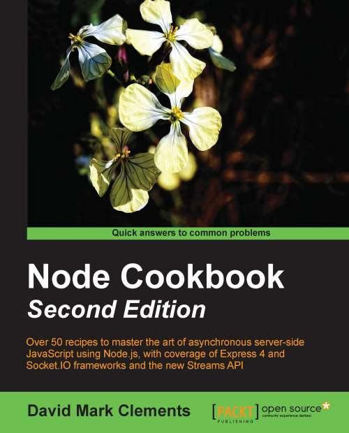

## Node Cookbook: Second Edition
- Cookbook
- David Mark Clements
- April 2014

Transferring your JavaScript skills to server-side programming is simplified with this comprehensive cookbook. Each chapter focuses on a different aspect of Node, featuring recipes supported with lots of illustrations, tips, and hints.

